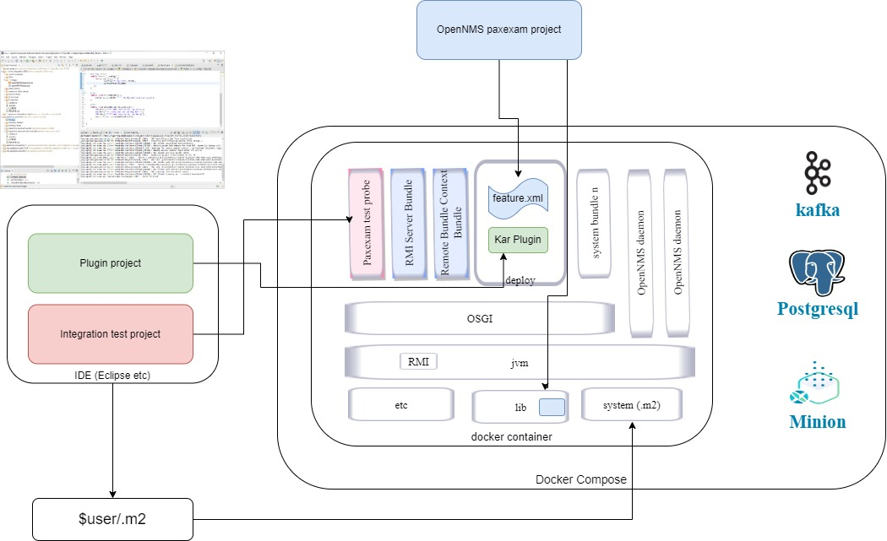

## OpenNMS Paxexam - Design Details

## Normal Pax-exam usage with karaf

The figure below illustrates Pax-exam's normal operation.  


Usually, when a Junit test is annotated with @RunWith(PaxExam.class), the pax-exam test system searches the class path of maven dependencies for a paxexam test container (which can be OSGi, Karaf, Felix ,Eclipse or even a J2EE container or Tomcat). 

If a karaf test container is being used, the test downloads and unpacks the container and then applies any custom configurations specified in the test class. 
It then starts the container.

Once karaf has started, pax-exam injects a 'Test Probe' bundle using RMI. 
The test probe contains the junit tests which are to be run within the OSGi container. 
The test can be annotated with services or the bundle contxt, and these will be wired from services running in the container before the test is run.

After the test has finished, the test probe is uninstalled and the karaf container is stopped unless it is specified to keep running between tests. 

This normal mode of operation is very suitable for mocking developer tests of OSGi modules but it isn't really useful if we have a pre-built application with an embedded karaf for which we want to do integration testing. 

In this case, we would like to have the full application running with it's normal configuration before we inject test probes into the running application. 

## Injected Pax-exam usage with stand alone OpenNMS or Karaf

The figure below illustrates how integration testing can be done against a running OpenNMS or stand alone Karaf.



### RMI Server (opennms-paxexam-rmi-server)

Pax-exam normally uses the built in RMI which it starts up as part of the test container. 
However, when testing an external system, there is no guarantee that the RMI configuration will be suitable. 

This is particularly the case in OpenNMS where the RMI is locked down to prevent external access. 

Historically, OpenNMS used RMI to allow remote download of remote pollers and some of this code still exists within the code base. The bootstrap code [Bootstrap.java](https://github.com/OpenNMS/opennms/blob/develop/opennms-bootstrap/src/main/java/org/opennms/bootstrap/Bootstrap.java) has a method configureRMI which sets up a locked down RMI server using the [HostRMIServerSocketFactory.java](https://github.com/OpenNMS/opennms/blob/develop/opennms-bootstrap/src/main/java/org/opennms/bootstrap/HostRMIServerSocketFactory.java)

In theory, the OpenNMS documentation, [configuring RMI](https://docs.opennms.com/meridian/2022/operation/admin/rmi.html), describes configuration for OpenNMS to accept RMI connections from any address, but examining the code and testing suggests that this is not actually the case.

For this reason, a separate RMI server bundle ( [opennms-paxexam-rmi-server](../opennms-paxexam/opennms-paxexam-parent\opennms-paxexam-rmi-server) ) has been created to be installed within the karaf container which runs on a specified port and accepts connections from any address.
This port is used both for the RMI registry for pax-exam and also for the RMI remote test calls.

Note also that for RMI to work, the stubb classes need to be on the class path as RMI does not know anything about maven. So for thsi reason, we need to copy some jars directly into the lib directory.

### Remote Bundle Context (pax-exam-container-rbc-onms)
The [pax-exam-container-rbc-onms](../opennms-paxexam/opennms-paxexam-parent\pax-exam-container-rbc-onms) is the service which runs in karaf and listens for pax-exam commands and loads junit tests onto the karaf container. 
When this bundle starts up it registers itswlf as PaxExam with the RMI Registry and listens on the same port for the paxexam system to make requests. 

### Remote Container (opennms-paxexam-container-remote)

The paxexam system needs a pax-exam container to start up the tests. 
This container simply proxys for the pax-exam-container-rbc-onms running in karaf.
We tell paxexam tests to use this container by annotating it in a class

```
@RunWith(PaxExam.class)
@ExamFactory(org.opennms.paxexam.container.OpenNMSPluginTestContainerFactory.class)

```

