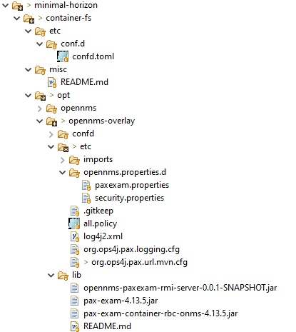

# Example opennms docker-compose project with paxexam

# Overview

## Key configuration elements


### OpenNMS etc configuration
Anyt files placed within opennms-overlay will be copied on startup as an overlay to the existing configuration by the OpenNMS container.

In the docker-compose file, we add 

```
  volumes:
      - ./container-fs/opt/opennms-overlay:/opt/opennms-overlay
```
The configuration files added are listed below




```
org.ops4j.pax.exam.rbc.rmi.host= horizon
org.ops4j.pax.exam.rbc.rmi.name= PaxExam
org.ops4j.pax.exam.rbc.rmi.port= 55555
pax.exam.service.timeout=20000

pax.exam.invoker=junit
org.ops4j.pax.exam.raw.extender.intern.Parser.DEFAULT_TIMEOUT=60000

```
These properties tell the paxexam container which host and port it is running on. 
You can have more than one container running pax-exam if you ensure the host and port names are different. 
Note that if you change the port from 55555, you must also change the exposed port in docker-compose.


This file may not be needed but is included here as an example of how the java security can be opened up to allow external RMI.

Logging
Change the logging overlay files to suit your test logging needs.
Some reasonable defaults provided.


The pax logging config has been changed so that karaf commands are listed properly and lone feeds are not escaped


```
# Common pattern layout for appenders
#log4j2.pattern = %d{ISO8601} | %-5p | %-16t | %-32c{1} | %X{bundle.id} - %X{bundle.name} - %X{bundle.version} | %encode{%.-500m}{CRLF}%n

# changed encoding so that we can print out commands and not escape \n characters in logs - note this may be security risk.
log4j2.pattern = %d{ISO8601} | %-5p | %-16t | %-32c{1} | %X{bundle.id} - %X{bundle.name} - %X{bundle.version} | %m%n

```

### OpenNMS deploy
Any jar or feature.xml included here will be used to load bundles into OpenNMS. 

A feature file is provided (pax-exam-features-opennms-4.13.5.xml) to start up the RMI server and the RemoteBundleContext which runs the tests. 
This feature file is required to set up the pax-exam system within the running OpenNMS.

A developer could overlay their own feature file or jars in deploy to run up their own plugin.
 
However the preferred method would be to have a test run a karaf command to install the feature from the user's .m2 repository.

In the docker-compose file, we add 

```
  volumes:
      - ./container-fs/opt/opennms/deploy:/opt/opennms/deploy
```

### injecting the maven .m2 repository
By default, OpenNMS is configured not to download any maven dependencies directly from the internet.
OpenNMS expects any required dependencies to be in the {opennms-home}/system repository or in the 'localRepository'.
So it is necessary to inject the test dependencies from the developer's project directly into the localRepository .m2 repo.

The default karaf location used for the local m2 repo is /usr/share/opennms/.m2

Unfortunately, if we use the default location, the entire .m2 repo will be scanned for jars by the OpenNMS [Bootstrap.java](https://github.com/OpenNMS/opennms/blob/develop/opennms-bootstrap/src/main/java/org/opennms/bootstrap/Bootstrap.java)

This can have unintended consequences depending on which jars are in the users .m2 repo.
In particular, this causes the opennms install to fail because it pulls in the entire .m2 repo into its classpath

see [Installer.java](https://github.com/OpenNMS/opennms/blob/develop/opennms-install/src/main/java/org/opennms/install/Installer.java)

```
context.setClassLoader(Bootstrap.loadClasses(new File(m_opennms_home), true));
```
However Bootstrap.java will not search the {opennms-home}/share directory, so we inject the .m2 repository there

in the docker-compose file, we add 

```
  volumes:
      - ~/.m2/repository:/usr/share/opennms/share/.m2/repository
```
and a corresponding configuraton in
etc/org.ops4j.pax.url.mvn.cfg

```
# setting location of .m2 repository so that it isnt scanned by the Bootloader which doesn't scan {opennms-home}/share
org.ops4j.pax.url.mvn.localRepository=/usr/share/opennms/share/.m2/repository
```
This makes the user's .m2/repository available for use by OpenNMS to resolve both the pax-exam dependencies but also to pick up the built modules from the developer's plugin project.

## Injecting jars into {opennms-home}/lib
Because RMI has no knowledge of maven or OSGi, it is neccessary to make some of the pax-exam jars directly available on the OpenNMS classpath.
These are injected into to {opennms-home}/lib directory

## Additional test classes {opennms-home}/share/misc
For debugging purposes and in order to test directly that the RMI is working, a test class is provided in the opennms-paxexam-container-remote.jar. 
This test tries to access the local RMI registry and list any registered services. 

This test class and it's dependencies are placed in the /opt/opennms/share/misc folder.
in the docker-compose file, we add 

```
  volumes:
      - ./container-fs/misc:/opt/opennms/share/misc

```
The test can be run within the OpenNMS horizon docker container using the following command. 
(You can change the address and port to suit the local configuration. e.g. TestRMILookup horizon 55555). 
```
cd /usr/share/opennms/share/misc
java -cp opennms-paxexam-rmi-server-0.0.1-SNAPSHOT.jar:opennms-paxexam-container-remote-0.0.1-SNAPSHOT.jar:pax-exam-container-rbc-onms-4.13.5.jar:pax-exam-4.13.5.jar:org.osgi.core-6.0.0.jar org.opennms.paxexam.container.main.TestRMILookup localhost 55555

result:

using arguments address=localhost port=55555
TestServiceLookup
registry:RegistryImpl_Stub[UnicastRef [liveRef: [endpoint:[localhost:55555](remote),objID:[0:0:0, 0]]]]
simple test registry names:
number of registry names:1
name: PaxExam
   name: PaxExam
 obj class: com.sun.proxy.$Proxy0
 obj.toString():  Proxy[RemoteBundleContext,RemoteObjectInvocationHandler[UnicastRef2 [liveRef: [endpoint:[localhost:55555,org.opennms.integration.paxexam.rmitestserver.PaxexamRMIServerSocketFactory@4cdbe50f](remote),objID:[392b447d:188ec5621b2:-7ff5, 1607189668500639864]]]]]
```

## Running the horizon docker-compose test environment

First build the main pax-exam project and then run maven in this project to install the dependencies.
See [Running Examples](../docs/RunningExamples.md")

```
mvn clean install
docker-compose up -d
```

To see the horizon logs as opennms starts up use
```
docker-compose  logs -f horizon
```

To get into the horizon container and view the karaf logs use

```
docker-compose exec horizon bash

opennms@horizon  tail -f logs/karaf.log
```

To get into the horizon container and access the karaf shell using ssh use

```
docker-compose exec horizon bash

ssh admin@horizon -p 8101  -o StrictHostKeyChecking=no
(password: admin)

```
to shut down use
```
docker-compose  down

or to clear all data in the containers

docker-compose  down -v

```

to see opennms UI

http://[::1]:8980/opennms/   username admin password admin
or
http://localhost:8980/opennms/

